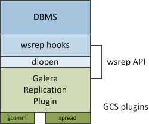

# Galera Cluster for MySQL介绍

## 关于数据库复制

数据库的复制，一般指的是在数据库集群中，数据在一个数据库服务节点拷贝到另一个数据库节点。常见的RDBMS的复制方式有两种——

* Master/Slave Replication

* Multi-master Replication

对于主从方式的复制方式，master节点上的写操作会通过数据库日志（如MySQ了的binary log）记录，并通过网络传递给slave节点，然后由slave节点根据master节点传递的日志执行这些变更。
而对于多主的复制方式，每个节点都可执行写操作，然后将写操作同步到其他节点。

无论是哪种方式，根据事务在集群中传递的方式，我们又将复制分为两类——
* Synchronous Replication - 同步复制，所有的节点在一个单一事务中完成同步，即，在一个事务提交时，所有节点有相同的值。
* Asynchronous Replication - 异步复制，主节点的写操作，异步的更新到其他节点中，即，当主节点事务提交时，在很短的时间内，有些节点的值与直接点不一致。

目前，我们的MySQL集群部署方式是双主，但是同一时刻所有的读写压力只在启动一台上，并没有真正意义上实现资源的合理利用，即，仅保证了高可用，但是没有保证负载均衡。

为了实现真正的数据库集群的负载均衡及高可用，我们找到了一个不错的MySQL集群的解决方案，即Galera Cluster for MySQL。它将多个数据库节点组织成一个cluster，并提供以下特性：
1. 同步复制，主备无延迟
2. 支持多主同时读写，保证数据一致性
3. 集群中各个节点保存全量数据
4. 节点添加或删除，集群具备自动监测和配置
5. 行级锁并行复制
6. 不需要写binlog

## Galera Cluster for MySQL架构

使用了Galera之后，客户端和Galera节点之间交互的时序图如下所示：

当客户端执行COMMIT命令，但实际提交未发生前，所有的数据库同一事务中的变更和变更行的主键会被收集到一个`write-set`中，紧接着，数据库节点就会将`write-set`发送到所有的其他节点。

之后，`write-set`会使用主键执行一次验证，这个操作在集群的每个节点上都会进行，验证操作决定了是否可以应用`write-set`。如果验证未通过，则节点丢掉`write-set`并且集群回滚；如果验证通过，则事务提交，并且`write-set`会被应用到集群的其他节点。

上面这中复制方式又称为“基于认证的复制”（Certification Based Replication）。

那么Galera Cluster内部又是如何工作的呢？

如上图所示，Galera Cluster有四个组件组成：
* DBMS - Galera Cluster支持MySQL、MariaDB和Percona XtraDB
* wsrep API  
* Galera Replication Plugin
* Group Communication plugins

这里就不一一展开具体解释了，详细的可以参见[Replication API](http://galeracluster.com/documentation-webpages/architecture.html#wsrep-api)

## 部分关键字解释

### Primary Componet

除了单一节点故障之外，集群可能会由于网络原因分裂成几个组件，在这种情况下，为了避免冲突，只有一个组件可以继续修改数据库状态，而这个组件，就称为Primary Component。

Primary Component其实是一个集群，当发生集群分裂的时候，Galera Cluster会执行一个特殊的权重算法，来选举一个组件作为Primary Component，如下图所示：

如果集群具有偶数个节点，则会存在脑裂的风险。如果由于网络导致集群被分裂成恰好数量相等的两个cluster，则每个cluster都有可能保持自己的权重，并且两个都会变成non-primary状态。

所以为了能够实现自动故障转移，需要至少三个节点——
* 单交换器的集群应该至少具备3个节点
* 跨交换机的集群应该至少具备3个交换机
* 跨网络的集群应该至少具备3个网络
* 跨数据中心的集群应该至少具备3个数据中心

### Replication Configuration

* wsrep_cluster_name - 集群名称，所有集群中的节点，名称必须一致。
* wsrep_cluster_address - 定义集群中的节点IP地址，多个地址使用逗号分割。
* wsrep_node_name - 节点名称。
* wsrep_node_address - 每个节点自己的IP地址。
* wsrep_provider - 定义Galera Replication Plugin的路径，安装之后不确定在哪里的情况下，可以通过`find / -name libgalera_smm.so` 来查找。
* wsrep_provider_options - 定义节点传递给wsrep provider的一些可选配置，如：`gcache.size`，表示节点缓存`write-sets`集合的磁盘空间，默认值是128M；`gcache.page_size`表示页存储中单页大小，整体页面存储的上限是磁盘的大小，默认值是128M。
* wsrep_method - 定义了节点在单个状态快照传输（State Snapshot Transfer，指完整的数据从一个集群节点——又称为donor——拷贝到一个新加入的节点——又称为joiner——的过程）中使用的方法或者脚本，支持的方法有`mysqldump`和`rsync`两种，在大数据集的场景中，后者比前者更快。

上面是我们`/etc/my.cnf.d/wsrep.cnf`文件中几个配置项的解释，更多的详细内容，请参见[http://galeracluster.com/documentation-webpages/reference.html](http://galeracluster.com/documentation-webpages/reference.html)。

