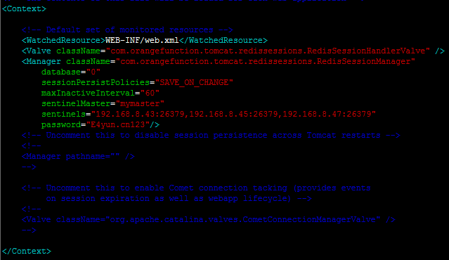
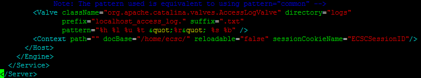
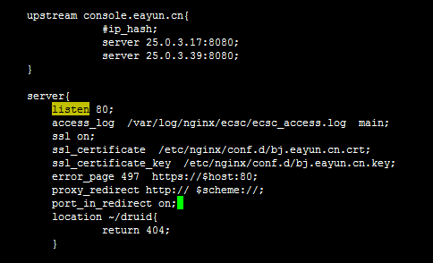

### 一、总体概述

调整规则为，取线上的配置文件，结合baseline中`ecsc_v1.3.0`版本的配置项，完善线上取到的配置文件，形成一份完整的适合线上部署的配置文件。

升级前版本为`v1.1.0`，升级后版本为`v1.4.0`。

本次用户中心大版本中，涉及到配置文件的调整主要是以下几点——
1. `db.properties`内容新增和调整；
2. Tomcat增加Session共享的配置文件修改及lib包增加；
3. Nginx中增加HTTPS访问及API相关设置
4. MySQL变更脚本的合并
5. 梳理要添加的过期删除的Collections
6. API工程中前台页面的删除
7. Tomcat程序包处理
8. MongoDB过期Collection数据删除JS脚本更新

### 二、具体变更

#### 1. db.properties

修改ECSC的`ecsc\WEB-INF\classes\db.properties`文件，也适用于下列应用：
* ECMC： `ecmc\WEB-INF\classes\db.properties`
* SMS：`sms\conf\db.properties`
* Mail：`mail\conf\db.properties`
* Schedule：`schedule\conf\db.properties`
* Schedule-res：`schedule-res\conf\db.properties`
* API：`api\WEB-INF\classes\db.properties`

主要涉及的内容是：
* 在UpYun中开通自主域名SSL证书，获取证书编号，来开启CDN的HTTPS访问
* 增加RabbitMQ集群配置
* 因为使用了万网DNS，增加万网DNS的AccessKey和SecretKey
* 增加支付宝支付的通知地址和返回地址 
* OBS的HTTPS配置变更
* ECSC、ECMC监控报警邮件所需的图片地址修改为HTTPS
* JDBC连接池配置参数调整

##### 1.1 CDN自主域名证书编号

在`db.properties`中增加证书编号：
```
# cdn certificate id
cdn.certificate.id=8620c63eb2dd6c0dafe65be24a955c6b
```
##### 1.2 增加RabbitMQ集群配置

在`db.properties`中增加RabbitMQ集群配置，注意，启动用户名和密码要变更：
```
#RabbitMQ
rabbitmq_address=25.0.3.52:5672,25.0.3.62:5672,25.0.3.72:5672
rabbitmq_username=guest
rabbitmq_password=guest
rabbitmq_vhost=/
rabbitmq_channel_cache_size=2
rabbitmq_publisher_confirms=true
rabbitmq_concurrent_consumers=2
rabbitmq_maxconcurrent_consumers=10
```
##### 1.3 增加万网DNS的AK/SK

在`db.properties`中增加DNS所用的AK/SK：
```
#ALiDNS
alidns.access.key.id=sSUkOaCS6N4RaP7n
alidns.access.key.secret=OAjtZGCGTQvkNVfU5kaNJLMCEz8aDH
```

##### 1.4 增加支付宝支付的通知地址和返回地址

在`db.properties`中增加支付宝支付所需要的接口地址：
```
# Alipay
alipay_trade_notify_url=https://console.eayun.cn/pay/alipay/tradeNotify.do
alipay_trade_return_url=https://console.eayun.cn/pay/alipay/tradeReturn.do
```

预生产环境中域名要修改为`https://ecsc.eayun.cn`

##### 1.5 OBS的HTTPS配置变更

将`db.properties`中的请求头改为`https://`，如下所示：
```
obs.eayunOBSRequest=https://
```

##### 1.6 监控报警邮件所需的图片地址修改为HTTPS

将`db.properties`中的报警邮件部分的`imgUrl`和`ecscUrl`，修改为`https://`：
```
# for alarm message mail 注意ECSC的地址是https
imgUrl=https://console.eayun.cn/images/logo3.png
ecscUrl=https://console.eayun.cn
ecmcUrl=http://admin.eayun.cn
```

##### 1.6 JDBC连接池配置参数调整
将`db.properties`中的`jdbc`部分调整如下：
```
jdbc.pool.initialSize=30
jdbc.pool.minIdle=30
jdbc.pool.maxActive=100
```
拿掉了maxIdle，增加了initialSize和minIdle。
此外，连接池的修改还需要修改`applicationContext-mysql.xml`，找到`Connection Pooling Info`，修改后如下图所示：
```
<!-- Connection Pooling Info -->
<property name="initialSize" value="${jdbc.pool.initialSize}" />
<property name="minIdle" value="${jdbc.pool.minIdle}" />
<property name="maxActive" value="${jdbc.pool.maxActive}" />
<property name="defaultAutoCommit" value="true" />
```

完整详细的文件内容如下：
```
jdbc.driver=com.mysql.jdbc.Driver
jdbc.pool.initialSize=30
jdbc.pool.minIdle=30
jdbc.pool.maxActive=100
jdbc.url=jdbc:mysql://25.0.3.41:3306/eayuncloud?zeroDateTimeBehavior=convertToNull&amp;useUnicode=true&amp;characterEncoding=UTF-8&amp;autoReconnect=true
jdbc.username=root
jdbc.password=E4yun.cn123

# mongo server
#mongo.host=192.168.8.35
mongo.replica.set=25.0.3.23:27017,25.0.3.32:27017
#mongo.port=37017
mongo.dbname=dev
mongo.connectionsPerHost=100
mongo.threadsAllowedToBlockForConnectionMultiplier=5
mongo.maxWaitTime=120000
mongo.connectTimeout=0
mongo.socketTimeout=0
mongo.autoConnectRetry=false
mongo.username= devDBAdmin
mongo.password= E4yun.cn234
# redis cluster
redis.cluster.master=mymaster
redis.cluster.node1=25.0.3.13:26379
redis.cluster.node2=25.0.3.24:26379
redis.cluster.node3=25.0.3.33:26379

# redis configuration
redis.ip=25.0.3.13
redis.port=6379
redis.timeout=60000
redis.maxTotal=200
redis.maxIdle=50
redis.maxWaitMillis=15000
redis.testOnBorrow=true
redis.testOnReturn=true
redis.testWhileIdle=true
redis.minEvictableIdleTimeMillis=60000
redis.timeBetweenEvictionRunsMillis=3000
redis.numTestsPerEvictionRun=-1
redis.password=E4yun.cn123

# dubbo
dubbo.registry.address=zookeeper://25.0.3.14:2181?backup=25.0.3.25:2181,25.0.3.34:2181

# for alarm message mail 注意ECSC的地址是https
imgUrl=https://console.eayun.cn/images/logo3.png
ecscUrl=https://console.eayun.cn
ecmcUrl=http://admin.eayun.cn

# fastdfs
connect_timeout = 2
network_timeout = 30
charset = ISO8859-1
http.tracker_http_port = 8080
http.anti_steal_token = no
http.secret_key = FastDFS1234567890
tracker_server = 25.0.3.11:22122
tracker_server = 25.0.3.21:22122

# eayunOBS
obs.eayunOBSHost=eos.eayun.com
obs.eayunOBSRequest=https://
obs.admin.access_key=EPFGBAGA7ARGXJ7OC6TY
obs.admin.secret_key=AEsES4PJLqtYNoSBBf3mjsv1xtsu8sNZ1bR0Bl8M

#RabbitMQ - 注意，username和password需要运维做变更，不能使用guest，具体参数需要等海涛研究完毕。
rabbitmq_address=25.0.3.52:5672,25.0.3.62:5672,25.0.3.72:5672
rabbitmq_username=eayuncloud
rabbitmq_password=E4yun.cn789
rabbitmq_vhost=/
rabbitmq_channel_cache_size=2
rabbitmq_publisher_confirms=true
rabbitmq_concurrent_consumers=2
rabbitmq_maxconcurrent_consumers=10

#ALiDNS
alidns.access.key.id=sSUkOaCS6N4RaP7n
alidns.access.key.secret=OAjtZGCGTQvkNVfU5kaNJLMCEz8aDH

# Alipay
alipay_trade_notify_url=https://console.eayun.cn/pay/alipay/tradeNotify.do
alipay_trade_return_url=https://console.eayun.cn/pay/alipay/tradeReturn.do

# CDN证书ID
cdn.certificate.id=8620c63eb2dd6c0dafe65be24a955c6b
```

#### 2. 增加Session共享的Tomcat配置

基于Redis的Tomcat Session共享配置，需要在两台`ECSC（25.0.3.17、25.0.3.39）`上进行。

将`tomcat-redis-session-manager-1.2.jar`、`jedis-2.6.1.jar`、`commons-pool2-2.2.jar`上传到Tomcat目录下的`/lib`目录下，编辑Tomcat配置文件`context.xml`：
```
# vim /home/apache-tomcat-7.0.67/conf/context.xml
```
如下图所示：


在`<context></context>`标签中间，增加如下内容：
```
<Valve className="com.orangefunction.tomcat.redissessions.RedisSessionHandlerValve" />
    <Manager className="com.orangefunction.tomcat.redissessions.RedisSessionManager"
        database="0"    
        sessionPersistPolicies="SAVE_ON_CHANGE"
        maxInactiveInterval="1800" 
        sentinelMaster="mymaster"
       	sentinels="25.0.3.13:26379,25.0.3.24:26379,25.0.3.33:26379"
        password="E4yun.cn123"/>

```

编辑Tomcat配置文件`server.xml`：
```
# vim /home/apache-tomcat-7.0.67/conf/server.xml
```
如下图所示，增加`sessionCookieName`配置：

即，在`<Context>`中增加`sessionCookieName="ECSCSessionID"`。

#### 3. Nginx配置

配置需要在两台`Nginx（25.0.3.18、25.0.3.28）`上进行。

获取公司的网站证书及Key文件，放到服务器指定目录下，如`/etc/nginx/conf.d`下，然后编辑Nginx的配置文件：
```
# vim /etc/nginx/nginx.conf 
```
在配置文件中中找到ECSC部分，在如下图所示位置：


将`upstream console.eayun.cn`中的`ip_hash`去掉，即：
```
upstream console.eayun.cn{
	server 25.0.3.17:8080;
	server 25.0.3.39:8080;
}
```
在`console.eayun.cn`的`server`部分，新增如下内容：
```
	ssl on;
	ssl_certificate  /etc/nginx/conf.d/server.crt;
	ssl_certificate_key  /etc/nginx/conf.d/server.key;
	error_page 497  https://$host:8080;
	proxy_redirect http:// $scheme://;# 每个应用服务器重定向的HTTP请求会被重写为HTTPS
	port_in_redirect on;# 启用或禁用Nginx在网站后面加上监听的端口，默认为启用。
```
本次用户中心增加了两个提供给EayunStack调用的接口，需要在Nginx中增加配置如下：
具体端口是否是`6060`，还需要与成都Stack团队、运维商议。
```
upstream api.eayun.com{
    server 25.0.3.19:8080;
    server 25.0.3.29:8080;
}
server{
	listen 6060;
	access_log  /var/log/nginx/api6060.log  main;

	location /{
	    	proxy_connect_timeout 300;
	        proxy_send_timeout 300;
	        proxy_read_timeout 300;
	        expires 10d;
	        proxy_pass  http://api.eayun.com ;
	        proxy_set_header Host $host;
	        proxy_set_header  X-Real-IP        $remote_addr;
	        proxy_set_header  X-Forwarded-For  $proxy_add_x_forwarded_for;
	        proxy_set_header X-NginX-Proxy true;
	}
}
```

#### 4. MySQL变更脚本合并

#### 5. MongoDB新增Collections梳理

新增的Collections的；
有变更的Collections。

#### 6. API工程中删除前端页面

#### 7. Tomcat程序包处理

本地拿到的`apache-tomcat-7.0.67.tar.gz`程序包删除`apache-tomcat-7.0.67/webapps/`下的所有文件夹及文件

#### 8. MongoDB过期Collection数据删除JS脚本更新

修改脚本`staleDataCleaner.js`——
补充col_timestamp中的集合名，将下列Collection补充到col_timestamp末尾：
```
	"cdn.backsource.1d",
	"cdn.backsource.1h",
	"cdn.backsource.1month",
	"cdn.backsource.api.details",
	"cdn.refresh.bucket",
	"cdn.refresh.object",
	"log.api.cdn",
	"log.api.dns",
	"log.charge.failed",
	"log.chargeRecord.op.fail",
	"log.obs.notice",
	"obs.cdn.1d",
	"obs.cdn.1h",
	"obs.cdn.1mon",
	"memory.usage.detail",
	"obs.used.1month",
	"obs.used.24h",
	"log.money.failed",
	"log.money.success"
```

同时由于本次新增的Collection还有
```
	"log.ecmc",//operDate
	"log.ecsc",//actTime
	"log.schedule",//jobStartTime
	"schedule.lost.job",//jobDate
```
需要对应增加function单独处理。