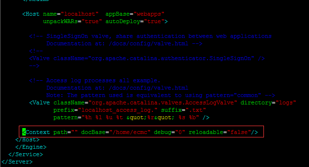

## 0.写在前面

本次上线，内部本版由`v1.1.0`升级至`v1.4.0`。

## 1.新建服务器

在eayuncloud三台物理机上搭建虚拟机

### 1.1 API机器

API机器公共硬件配置如下：
* CPU：4
* 内存：8GB  
* 硬盘：200GB

#### 1.1.1 API-1

* IP：25.0.3.19  
* 物理机：eayuncloud-1 
* 数据文件：/var/lib/libvirt/images/api-1.img

#### 1.1.2 API-2

* IP：25.0.3.29
* 物理机：eayuncloud-2
* 数据文件：/var/lib/libvirt/images/api-2.img

### 1.2 schedule-res机器

schedule-res机器公共硬件配置如下：
* CPU：4
* 内存：8GB
* 硬盘：100GB

#### 1.2.1 schedule-res-1

* IP：25.0.3.51  
* 物理机：eayuncloud-1 
* 数据文件：/var/lib/libvirt/images/schedule-res-1.img

#### 1.2.2 schedule-res-2

* IP：25.0.3.61
* 物理机：eayuncloud-2
* 数据文件：/var/lib/libvirt/images/schedule-res-2.img

### 1.3 RabbitMQ机器

RabbitMQ机器公共硬件配置如下：
* CPU：4
* 内存：8GB  
* 硬盘：200GB

#### 1.3.1 rabbit-mq-1

* IP：25.0.3.52  
* 物理机：eayuncloud-1 
* 数据文件：/var/lib/libvirt/images/mq-1.img

#### 1.3.2 rabbit-mq-2

* IP：25.0.3.62
* 物理机：eayuncloud-2
* 数据文件：/var/lib/libvirt/images/mq-2.img

#### 1.3.3 rabbit-mq-3

* IP：25.0.3.72
* 物理机：eayuncloud-4
* 数据文件：/home/image/mq-3.img


## 2.新增服务程序上传和安装部署

### 2.1 程序上传

将下列表格中需要上传的文件，先上传到eayuncloud-4上，然后scp到指定服务器的目标目录。

|   程序文件   |   目标服务器   |   目标目录   |
|:-------------:|:---------------:|:-------------:|
| mail.tar |mail-sms-1, mail-sms-2 |/home|
| sms.tar  |mail-sms-1, mail-sms-2 |/home|
| schedule.tar |schedule-1, schedule-2 |/home|
| schedule-res.tar |schedule-res-1, schedule-res-2 |/home|
| eayun-api.tar |api-1, api-2 |/home|
| eayun-ecsc.tar |ecsc-1, ecsc-2 |/home|
| eayun-ecmc.tar |ecmc-1, ecmc-2 |/home|
| web-ecmc.tar.gz|ecmc-1, ecmc-2 |/home|


### 2.2 API

#### 2.2.1 安装JDK

将`jdk-7u80-linux-x64.rpm`传到`/home`文件夹下，执行命令安装JDK：
```
# cd /home
# rpm -ivh jdk-7u80-linux-x64.rpm
```
修改`/etc/profile`文件：
```
# vim /etc/profile
```
在文件末尾补充如下内容：
```
export JAVA_HOME=/usr/java/jdk1.7.0_80
export CLASSPATH=.:/usr/java/jdk1.7.0_80/lib
export PATH=$JAVA_HOME/bin:$PATH

```
修改完毕，保存，使环境变量生效：
```
# source /etc/profile
```
#### 2.2.2 安装Tomcat

打开防火墙`8080`端口：
```
# vim /etc/sysconfig/iptables
```
增加如下内容到防火墙中：
```
-A INPUT -m state --state NEW -m tcp -p tcp --dport 8080 -j ACCEPT
```

重启防火墙服务：
```
# service iptables restart
```
将Tomcat安装包上传到`/home`下，然后开始安装：
```
# cd /home
# tar zxvf apache-tomcat-7.0.67.tar.gz
```
修改启动文件：
```
# vim /home/apache-tomcat-7.0.67/bin/catalina.sh
```
添加JAVA_OPTS设置到`catalina.sh`中：
```
JAVA_OPTS="$JAVA_OPTS  -Xms1024m -Xmx4096m -XX:PermSize=128m -XX:MaxPermSize=512m "
```
检查Tomcat原`webapps`目录是否为空，如果不为空，则需要删除目录中的所有内容：
```
# mv /home/apache-tomcat-7.0.67/webapps /home/apache-tomcat-7.0.67/webapps_del
# mkdir /home/apache-tomcat-7.0.67/webapps
```

#### 2.2.3 部署API程序

```
# cd /home
# tar xvf eayun-api.tar
# mv eayun-api api
```
修改Tomcat中`server.xml`文件中的文件目录：
```
# vim /home/apache-tomcat-7.0.67/conf/server.xml
```
修改如所示的`<Context>`标签的内容：



按照如下内容修改配置：
```
<Context path="" docBase="/home/api" debug="0" reloadable="false"/>
```

### 2.3 Schedule-res

#### 2.3.1 安装JDK

将`jdk-7u80-linux-x64.rpm`传到`/home`文件夹下，执行命令安装JDK：
```
# cd /home
# rpm -ivh jdk-7u80-linux-x64.rpm
```
修改`/etc/profile`文件：
```
# vim /etc/profile
```
在文件末尾补充如下内容：
```
export JAVA_HOME=/usr/java/jdk1.7.0_80
export CLASSPATH=.:/usr/java/jdk1.7.0_80/lib
export PATH=$JAVA_HOME/bin:$PATH

```
修改完毕，保存，使环境变量生效：
```
# source /etc/profile
```

#### 2.3.2 配置防火墙

打开防火墙`20883`端口：
```
# vim /etc/sysconfig/iptables
```
增加如下内容到防火墙中：
```
-A INPUT -m state --state NEW -m tcp -p tcp --dport 20883 -j ACCEPT
```

重启防火墙服务：
```
# service iptables restart
```

#### 2.3.3 部署服务

```
# cd /home
# tar xvf schedule-res.tar
# chmod +x /home/schedule-res/startup.sh
```

### 2.4 RabbitMQ 

#### 2.4.1 公共软件配置

切换到`/home`下：
```
# cd /home
```
上传erlang软件包`erlang-18.3-1.el6.x86_64.rpm`和RabbitMQ安装包`rabbitmq-server-generic-unix-3.6.3.tar.xz`

安装Erlang：
```
# yum install -y erlang-18.3-1.el6.x86_64.rpm
```
检查Erlabg安装情况：
```
# erl -version
```
解压`RabbitMQ.tar.xz`：
```
# yum install -y xz
# tar -xvf rabbitmq-server-generic-unix-3.6.3.tar.xz
```
添加环境变量：
```
# vim /etc/profile
```
在`/etc/profile`文件的最后添加上：
```
export RABBITMQ_HOME="/home/rabbitmq_server-3.6.3"
export PATH="$RABBITMQ_HOME/sbin:$PATH"
```

在主机的`/etc/hosts`中配置IP映射：
```
# vim /etc/hosts

25.0.3.52 rabbit1
25.0.3.62 rabbit2
25.0.3.72 rabbit3
```
开放防火墙指定端口：
```
# vim /etc/sysconfig/iptables

-A INPUT -p tcp -m state --state NEW -m tcp --dport 5672 -j ACCEPT
-A INPUT -p tcp -m state --state NEW -m tcp --dport 15672 -j ACCEPT
-A INPUT -p tcp -m state --state NEW -m tcp --dport 25672 -j ACCEPT
-A INPUT -p tcp -m state --state NEW -m tcp --dport 4369 -j ACCEPT

```
重启iptables使服务生效：
```
# service iptables restart
```

初始化配置文件`rabbitmq.config`：
```
# vim /home/rabbitmq_server-3.6.3/etc/rabbitmq/rabbitmq.config
```
在文档中写入如下内容，注意`default_user`和`default_pass`的配置，需要与`db.properties`中的用户名密码保持一致，不允许是`guest`：
```
[
     {rabbit,
         [
                {tcp_listeners, [5672]},
                {num_tcp_acceptors, 10},
                {log_levels, [{connection, info}, {channel, info},{federation, info},{mirroring, info}]},
                {loopback_users, [] },
                {default_vhost,       <<"/">>},
                {default_user,        <<"eayuncloud">>},
                {default_pass,        <<"E4yun.cn789">>},
                {default_permissions, [<<".*">>, <<".*">>, <<".*">>]},
                {default_user_tags, [administrator]},
              	{cluster_nodes, {['rabbit@rabbit1', 'rabbit@rabbit2','rabbit@rabbit3'], disc}},
                {channel_max, 0}
        ]
     }
].

```
编辑配置文件`enabled_plugins`：
```
# vim /home/rabbitmq_server-3.6.3/etc/rabbitmq/enabled_plugins
```
写入`[rabbitmq_management,rabbitmq_tracing].`

重启操作系统使配置生效。

#### 2.4.2 RabbitMQ集群配置

登录到rabbit1，启动RabbitMQ服务：
```
# rabbitmq-server -detached
```
获取rabbit1服务器上`.erlang.cookie`文件中的内容：
```
# more /root/.erlang.cookie
GHFTDTXKOBDFRLLZGXFK
```
登录rabbit2服务器上，先启动RabbitMQ服务，生成`.erlang.cookie`文件：
```
# rabbitmq-server -detached
```
然后停止rabbit2服务器上的RabbitMQ服务，并修改`.erlang.cookie`的内容：
```
# rabbitmqctl stop
# chmod +w /root/.erlang.cookie
# vim /root/.erlang.cookie
```
将rabbit1服务器上获取的`.erlang.cookie`文件内容覆盖到rabbit2上的该文件内容，保存后，去掉该文件的可写权限，并重新启动服务：
```
# chmod -w /root/.erlang.cookie
# rabbitmq-server -detached
```
然后停止当前节点，注意，跟之前停止服务不一样！——
```
# rabbitmqctl stop_app
```
执行命令重置该节点之前的配置：
```
# rabbitmqctl reset
```
将该节点加入住节点：
```
# rabbitmqctl join_cluster rabbit@rabbit1
```
启动该节点，并查看集群状态：
```
# rabbitmqctl start_app
# rabbitmqctl cluster_status
```
注意观察集群状态中的`running_nodes`。

注意：rabbit3节点服务的部署形式，与rabbit2相同。

此外，为了保证高可用配置，我们还需要在rabbit1上执行如下命令：
```
# rabbitmqctl set_policy -p / ha-allqueue "." '{"ha-mode":"all","ha-sync-mode":"automatic"}'
```
使用该命令之后，集群中的所有节点都会执行队列的mirror功能以实现高可用。为了测试RabbitMQ的高可用状态，我们可以通过下列命令，在三台节点上分别查看集群状态：
```
# rabbitmqctl list_policies
```

### 2.5 Nginx配置

配置需要在两台`Nginx（25.0.3.18、25.0.3.28）`上进行。

打开防火墙的`443`端口：
```
# vim /etc/sysconfig/iptables
-A INPUT -m state --state NEW -m tcp -p tcp --dport 443 -j ACCEPT
```

获取公司的网站证书`bj.eayun.cn.crt`及Key文件`bj.eayun.cn.key`（命名以实际为准），放到服务器指定目录`/etc/nginx/conf.d`，然后编辑Nginx的配置文件：
```
# vim /etc/nginx/nginx.conf 
```
在配置文件中中找到ECSC部分，在如下图所示位置：


将`upstream console.eayun.cn`中的`ip_hash`去掉，即：
```
upstream console.eayun.cn{
	server 25.0.3.17:8080;
	server 25.0.3.39:8080;
}
```
在`console.eayun.cn`的`server`部分，修改监听端口为`443`，并增加如下内容：
```
	listen 443;
	server_name console.eayun.cn;
	ssl on;
	ssl_certificate  /etc/nginx/conf.d/bj.eayun.cn.crt;
	ssl_certificate_key  /etc/nginx/conf.d/bj.eayun.cn.key;
	error_page 497  https://$host:443;
	proxy_redirect http:// $scheme://;# 每个应用服务器重定向的HTTP请求会被重写为HTTPS
	port_in_redirect on;# 启用或禁用Nginx在网站后面加上监听的端口，默认为启用。
```
>注意：因为ECSC将监听端口修改为443，所以外网映射的时候也需要将端口修改为443，即访问ECSC的地址为`25.0.3.42:443`

本次用户中心增加了两个提供给EayunStack调用的接口，需要在Nginx中增加配置如下：
```
upstream api.eayun.com{
    server 25.0.3.19:8080;
    server 25.0.3.29:8080;
}
server{
	listen 80;
	server_name api.eayun.com;
	access_log  /var/log/nginx/api80.log  main;

	location /{
	    	proxy_connect_timeout 300;
	        proxy_send_timeout 300;
	        proxy_read_timeout 300;
	        expires 10d;
	        proxy_pass  http://api.eayun.com ;
	        proxy_set_header Host $host;
	        proxy_set_header  X-Real-IP        $remote_addr;
	        proxy_set_header  X-Forwarded-For  $proxy_add_x_forwarded_for;
	        proxy_set_header X-NginX-Proxy true;
	}
}
```


## 3.停止全部应用服务

本次用户中心上线涉及改动较多，为规避风险，不做平滑升级。

### 3.1 停止ECSC服务

登录`mysql-1`，使用SQL检查是否有正在创建中的云资源，一共6个SQL：
```sql
select count(vm_id) from cloud_vm 
	where	is_deleted = '0' and vm_status in ('BUILDING','DELETING','STARTING','SHUTOFFING','SUSPENDEDING',
	'RESUMING','REBOOT','HARD_REBOOT','RESIZE','VERIFY_RESIZE','RESIZED','REVERT_RESIZE');
select count(vol_id) from cloud_volume 
	where vol_status <> 'AVAILABLE' and vol_status <> 'ERROR' and  vol_status <> 'IN-USE' and is_deleted <> '1';
select count(snap_id) from cloud_disksnapshot 
	where snap_status <> 'AVAILABLE' and snap_status <> 'ERROR';
select count(image_id) from cloud_image 
	where image_status <> 'ACTIVE' and image_status <> 'DELETED';
select count(*) from cloud_ldpool where pool_status = 'PENDING_CREATE';
select count(*) from cloud_ldmember where member_status = 'PENDING_CREATE';
```

无正在创建中的云资源，分别登录`ecsc-1（25.0.3.17）`和`ecsc-2（25.0.3.39）`，可以查看ECSC的<PID>并停止服务：
```
# ps -ef | grep java
# kill -9 <PID>
```
### 3.2 停止ECMC服务

分别登录`ecmc-1（25.0.3.27）`和`ecmc-2（25.0.3.40）`，查看服务<PID>并停止服务：
```
# ps -ef | grep java
# kill -9 <PID>
```

### 3.3 停止Schedule服务

分别登录`schedule-1（25.0.3.26）`和`schedule-2（25.0.3.38）`，查看服务<PID>并停止服务：
```
# ps -ef | grep java
# kill -15 <PID>
```

### 3.4 停止Mail-SMS服务

分别登录`mail-sms-1（25.0.3.16）`和`mail-sms-2（25.0.3.37）`，查看服务<PID>并停止服务：
```
# ps -ef | grep java
# kill -9 <PID>
```

### 3.5 停止Nginx服务

分别登录`nginx-1（25.0.3.18）`和`nginx-2（25.0.3.28）`，停止Keepalived和Nginx服务：
```
# service keepalived stop
# service nginx stop
```

## 4.数据库处理

### 4.1 MySQL处理

MySQL的处理主要涉及执行本次版本开发中产出的数据库脚本

#### 4.1.1 备份

目前MySQL的集群为双主模式（Multi-master），所以在`mysql-1（25.0.3.15）`服务器上备份数据均可：
```
# mysqldump -uroot -p eayuncloud > /home/eayuncloud_20170305.sql
```
执行上述命令之后，需要输入数据库密码，然后才可以执行备份工作。

#### 4.1.2 执行数据库变更脚本

上传数据库变更脚本`updateSQL_usercenter.sql`到`mysql-1（25.0.3.15）`的`/root`下，使用如下命令执行数据库登录mysql shell，执行变更脚本，注意按照提示输入密码：
```
# mysql -uroot -p --default-character-set=utf8
mysql> use eayuncloud
mysql> source /root/updateSQL_usercenter.sql
```

#### 4.1.3 简单验证

找两到三个变更项，分别查看主从数据库表的变更情况，如：
```
# 查看cloud_vm表中charge_state状态
mysql> select charge_state from cloud_vm;
# 查看sys_selfcustomer中的is_blocked和over_credit_time
mysql> select is_blocked, over_credit_time from sys_selfcustomer;
# 查看新增计费清单表表结构
mysql> show columns from money_chargerecord;

```

### 4.2 MongoDB处理

#### 4.2.1 构建索引

MongoDB的处理主要是使用脚本构建Collection的索引。

将`buildIndexes.js`和`buildIndexes.sh`上传到`mongodb-master（25.0.3.23）`的`/home`下，执行脚本：
```
# chmod +x /home/buildIndexes.sh
# /home/buildIndexes.sh
```

>注：如果遇到buildIndexes.sh无法执行，可以执行命令：
>```
># cat -A buildIndexes.sh
> /root/mongodb-linux-x86_64-3.0.6/bin/mongo 25.0.3.23:27017/dev -u <xx> -p <xx> -quiet /root/buildIndexes.js$
>```
>看到末尾是单个$符号即编码没有问题，如果是M$，则由于Windows编码问题导致文件无法正常读取，需要重新在Linux下创建脚本。

#### 4.2.2 更新删除90天的MongoDB数据脚本

将`staleDataCleaner.js`替换即可。


## 5.应用服务升级和启动

### 5.1 Mail-SMS

分别登录`mail-sms-1（25.0.3.16）`和`mail-sms-2（25.0.3.37）`进行下面的操作。

将后台程序目录`/home/mail`备份：
```
# mv /home/mail /home/mail_20170305
```
切换目录，解压程序文件，修改启动脚本权限，启动服务：
```
# cd /home
# tar xvf mail.tar
# mv /home/mail_20170305/startup.sh /home/mail/
# cd /home/mail/
# nohup sh startup.sh &
```

启动过程中，查看日志，确保服务启动正常：
```
# tail -f /home/maillog/mail.log
```
另外，还要查看一下进程：
```
# ps -ef | grep java
```
sms服务同理——

将后台程序目录`/home/sms`备份：
```
# mv /home/sms /home/sms_20170305
```
切换目录，解压程序文件，将新目录的`startup.sh`替换为备份目录中的脚本，启动服务：
```
# cd /home
# tar xvf sms.tar
# mv /home/sms_20170305/startup.sh /home/sms/
# cd /home/sms/
# nohup sh startup.sh &
```

启动过程中，查看日志，确保服务启动正常：
```
# tail -f /home/smslog/sms.log
```
另外，还要查看一下进程：
```
# ps -ef | grep java
```

### 5.2 Schedule

分别登录`schedule-1（25.0.3.26）`和`schedule-2（25.0.3.38）`进行下面的操作。

将后台程序目录`/home/schedule`备份：
```
# mv /home/schedule /home/schedule_20170305
```
切换目录，解压程序文件，修改启动脚本权限，启动服务：
```
# cd /home
# tar xvf schedule.tar
# mv /home/schedule_20170305/startup.sh /home/schedule/
# cd /home/schedule/
# nohup sh startup.sh &

```

启动过程中，查看日志，确保服务启动正常：
```
# tail -f /home/schedulelog/schedule.log
```
另外，还要查看一下进程：
```
# ps -ef | grep java
```

### 5.3 Schedule-Res

分别登录`schedule-res-1（25.0.3.51）`和`schedule-res-2（25.0.3.61）`进行下面的操作。

启动服务：
```
# cd /home/schedule-res
# nohup sh startup.sh &
```

启动过程中，查看日志，确保服务启动正常：
```
# tail -f /home/schedulereslog/scheduleres.log
```
另外，还要查看一下进程：
```
# ps -ef | grep java
```

### 5.4 API

分别登录`API-1（25.0.3.19）`和`API-2（25.0.3.29）`两台机器前面我们已经部署好了API的服务，所以直接启动服务即可：
```
# /home/apache-tomcat-7.0.64/bin/startup.sh
```
启动过程中，检查日志输出，启动后查看进程：
```
# tail -f /home/apache-tomcat-7.0.67/logs/catalina.out 
# tail -f /home/apilog/api.log
```

### 5.5 ECSC

分别登录`ecsc-1（25.0.3.17）`和`ecsc-2（25.0.3.39）`两台服务器做如下操作——

将`/home/ecsc`备份：
```
# mv /home/ecsc /home/ecsc_20170305
```

切换目录，解压程序文件，启动服务：
```
# cd /home
# tar xvf ecsc.tar
# /home/apache-tomcat-7.0.64/bin/startup.sh
```
启动过程中需要查看日志：
```
# tail -f /home/apache-tomcat-7.0.67/logs/catalina.out 
# tail -f /home/ecsclog/ecsc.log 
```
服务启动后，直接访问升级后的机器服务，检查服务是否可用。

### 5.6 ECMC

分别登录`ecmc-1（25.0.3.27）`和`ecmc-2（25.0.3.40）`两台服务器做如下操作——

将后台程序目录`/home/ecmc`备份：
```
# mv /home/ecmc /home/ecmc_20170305
```
切换目录，解压程序文件，启动后台服务：
```
# cd /home
# tar xvf ecmc.tar
# /home/apache-tomcat-7.0.64/bin/startup.sh
```

将前台服务目录`/home/web-ecmc/dist`备份：
```
# cd /home
# mkdir web-ecmc_20170305
# mv /home/web-ecmc/dist /home/web-ecmc_20170305/
```

将前台新程序上传到`/home`下，解压缩并将文件目录直接替换到web-ecmc下：
```
# cd /home
# tar -zxvf web-ecmc.tar.gz
# mv /home/dist /home/web-ecmc/
```

启动过程中需要查看日志：
```
# tail -f /home/apache-tomcat-7.0.67/logs/catalina.out 
# tail -f /home/ecmclog/ecmc.log 
```
服务启动后，直接访问升级后的机器服务，检查服务是否可用。


### 5.7 Nginx

重启防火墙：
```
# service iptables restart
```
启动服务
```
# /usr/sbin/nginx -c /etc/nginx/nginx.conf
# service keepalived start
```
检查Nginx状态：
```
# service nginx status
```
检查Keepalived的VIP漂移情况，在两台Nginx服务器上分别使用如下命令：
```
# ip addr show dev eth0
```
能够看到两台服务器上的其中一台具备额外的VIP。

## 6.历史数据处理

### 6.1 缓存同步

使用root用户登录ECMC，依次点击

* 标签缓存同步
* 数据字典同步
* 短信配额同步
* 对象存储同步
* 价格缓存同步
* 客户冻结状态同步
* ecsc监控报警缓存同步、ecmc监控报警缓存同步
* ecsc日志同步、ecmc日志同步

### 6.2 业务数据的处理

上传历史数据处理SQL`updateSQL_usercenter_updateOldData.sql`到`mysql-1（25.0.3.15）`的`/root`下，使用如下命令执行数据库登录mysql shell，执行变更脚本，注意按照提示输入密码：
```
# mysql -uroot -p --default-character-set=utf8
mysql> use eayuncloud
mysql> source /root/updateSQL_usercenter_updateOldData.sql.sql
```


### 6.3 数据中心同步

运维管理员进行数据中心同步

## 7.正确性验证

* 正常访问；
* 当晚云资源按需和预付费的余额/支付宝购买成功，提供第二天测试验证。

## 8 服务器时间同步

请在所有的服务器上添加时间同步crontab计划任务，避免应用间、应用与标准时间误差较大造成计费等功能不准确。

## 9 回退

### 9.1 恢复备份的MySQL数据库

下面的恢复操作，在`mysql-1（25.0.3.15）`执行即可，经过验证，双主两台mysql服务器可以实现同步。
```
# mysql -uroot -p--default-character-set=utf8
mysql> drop database eayuncloud; 	//删掉数据库eayuncloud
mysql> show databases;			//查看数据库
mysql> create database eayuncloud; 	//新建eayuncloud数据库
mysql> exit;
# mysql -uroot -p --default-character-set=utf8 eayuncloud < /home/eayuncloud_20170305.sql //这里使用的是之前备份出来的*.sql文件
```
注：除了上面的使用`mysql`来恢复备份出来的`*.sql`文件，还可以采用下面的方式：
```
# mysql -uroot -p--default-character-set=utf8
mysql> use eayuncloud;
mysql> source /home/eayuncloud_20170305.sql 
```

### 9.2 恢复MongoDB

回退时，新增的collections要删除，有变更的collection要删掉结构不统一的document。
将`rollbackMongoDB.js`和`rollbackMongoDB.sh`上传到`/home`目录下，为`rollbackMongoDB.sh`赋执行权限，然后执行脚本，即可对新增的Collections进行删除，对新增fields的document删除掉多余的fields：
```
# chmod +x /home/rollbackMongoDB.sh
# ./home/rollbackMongoDB.sh
```

### 9.3 恢复服务

将需要回退的服务停止，恢复备份目录，如：
```
# mv /home/ecsc_20170305 /home/ecsc
```
按照启动手册启动服务即可。

回退后，还需要按照第六章节说明进行数据同步。


