## 1. 数据存量

在压测开始之前，编写了一些造业务数据的程序，用于提供Load Runner进行压测时使用。第一轮和第二轮测试前，数据存量对比如下：

|Biz| 1st | 2nd |
|:-----|:-----|:----|
|客户数量-sys_selfcustomer|100|300|
|用户数量-sys_selfuser|2599|5299|
|订单记录-order_info|51980|214271|
|交易记录-money_record|44335|92348|
|报警信息-ecsc_alarmmessage|50028|175029|
|网络-cloud_network|5000|5000|
|路由-cloud_route|5000|5000|
|子网-cloud_subnetwork|25000|25000|
|云主机-cloud_vm|25000|50000|
|云硬盘-cloud_volume|5000|10000|
|云硬盘快照-cloud_disksnapshot|25000|25000|
|bandwith.network.incoming.detail|24140|24140|
|bandwith.network.outgoing.detail|24140|24140|

第二轮数据比第一轮普遍多，原因在于第一轮造数之后被同步的计划任务干掉了一些，后面又重复造了数据。

## 2. 第一次调整优化

第一次调整优化，是建立在第一轮压测结果普遍不理想的情况下：

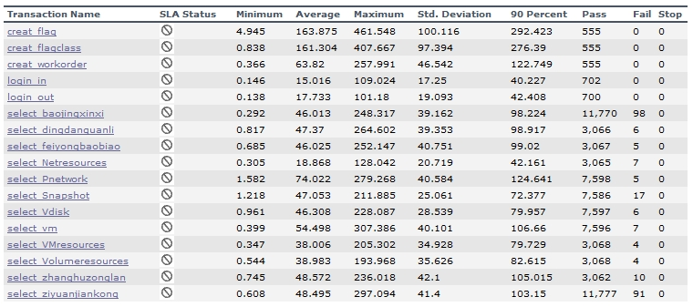
图为第一次压测时700人并发压测2h的结果

主要考虑的方向是**配置参数的调整**，主要涉及三个方面：
* JDBC数据库连接池配置调整
* Tomcat配置调整
* MySQL配置调整

### 2.1 JDBC配置调整

在未做任何调整之前，我们的JDBC配置除了必要的url、用户名和密码信息，只有两个简单的参数：
```
jdbc.pool.maxActive=30
jdbc.pool.maxIdle=10
```
简单讲一下连个参数：
* maxActive - (int) The maximum number of active connections that can be allocated from this pool at the same time. The default value is 100
* maxIdle - (int) The maximum number of connections that should be kept in the pool at all times. 

那么对于`maxActive`来讲，默认值是100，我们的ECSC配置的是30，显然是不合理的。对于`maxIdle`来说呢，我们使用的数据库连接池是阿里的Druid，其中该配置项是不建议使用的，所以我们要弃之。此外引入的是`initialSize`和`minIdle`，所以更改后的配置如下：
```
jdbc.pool.initialSize=30 //初始连接池的连接数
jdbc.pool.minIdle=50 	//连接池始终建立的最小连接数
jdbc.pool.maxActive=300 //连接池的最大连接数
```
修改JDBC配置的目的是提高同时建立的数据库连接池连接数，增加处理能力，效果十分明显，查看MySQL连接数，在压力测试时，能最多使用738个连接，相比之前最大使用了277个连接，是有了长足的进步。
```
mysql> show status like 'max%connections';
+----------------------+-------+
| Variable_name        | Value |
+----------------------+-------+
| Max_used_connections | 738   |
+----------------------+-------+
1 row in set (0.00 sec)
```

> Tips: [JDBC Pool Common Attributes](https://tomcat.apache.org/tomcat-7.0-doc/jdbc-pool.html)


### 2.2 Tomcat配置调整

之前的Tomcat默认使用了BIO，也没有开启线程池，maxThreads=300，基本上未做优化。
本次参数调整，主要涉及的是增加线程池，增加线程池中的最大线程数（单核CPU配置为200左右是正常的，对于我们的四核CPU的MySQL服务器，可以开到800没问题的），开启NIO，调整使用NIO模型时接收线程的数目，增加等待连接队列长度（acceptCount），禁用DNS查询，最终TOMCAT_PATH/conf/server.xml中变更的配置如下：
```xml
<Executor name="tomcatThreadPool" namePrefix="catalina-exec-"
	maxThreads="800"
	minSpareThreads="30"
	maxIdleTime="60000"/>
<Connector executor="tomcatThreadPool"
	port="8080"
	acceptCount="200"
	protocol="org.apache.coyote.http11.Http11NioProtocol"
	acceptorThreadCount="2"
	enableLookups="false"
	connectionTimeout="60000"
	redirectPort="8443" />
```

> Tips: [Tomcat 7 Http Connector](https://tomcat.apache.org/tomcat-7.0-doc/config/http.html)

### 2.3 MySQL配置

MySQL的调优有很多方面，深入进去能讲一本书，比如[《High Performance MySQL, 3rd Edition》](http://shop.oreilly.com/product/0636920022343.do)。我们本次只是调整来两个配置项，分别是添加query_cache_size和打开慢查询。

query_cache_size的意义在于一个SELECT查询在DB中工作后，DB会把该语句缓存下来，当同样的一个SQL再次来到DB里调用时，DB在该表没发生变化的情况下把结果从缓存中返回给Client。那么如果查询语句涉及的表在这段时间内发生变更，那么首先会把query_cache和该表相关的语句全部置为失效，然后写入更新，如果query_cache非常大，该表的查询结构又比较多，查询语句失效也慢，Update或是Insert就会很慢。慎用。

本次配置`/etc/my.cnf`中，在[mysqld]部分中增加：
```
query_cache_size = 134217728
query_cache_type=1
query_cache_limit=1048576
slow_query_log_file=/var/run/mysqld/slowquery.log
long_query_time=5
slow_query_log=1
log_queries_not_using_indexes=1
```
重启MySQL服务，在MySQL shell中验证配置是否生效：
```
mysql> show variables like '%quer%';
+-------------------------------+-------------------------------+
| Variable_name                 | Value                         |
+-------------------------------+-------------------------------+
| ft_query_expansion_limit      | 20                            |
| have_query_cache              | YES                           |
| log_queries_not_using_indexes | ON                            |
| log_slow_queries              | ON                            |
| long_query_time               | 5.000000                      |
| query_alloc_block_size        | 8192                          |
| query_cache_limit             | 1048576                       |
| query_cache_min_res_unit      | 4096                          |
| query_cache_size              | 134217728                     |
| query_cache_type              | ON                            |
| query_cache_wlock_invalidate  | OFF                           |
| query_prealloc_size           | 8192                          |
| slow_query_log                | ON                            |
| slow_query_log_file           | /var/run/mysqld/slowquery.log |
+-------------------------------+-------------------------------+
14 rows in set (0.00 sec)
```

## 3. 第二次调整优化

在第一次调整完之后，又进行了压测，下图为500人并发持续压测3.5h的结果：

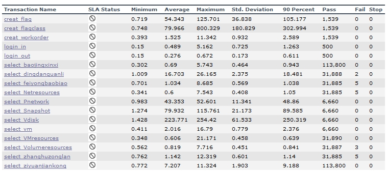

从本次的测试结果来看，绝大部分的响应时间有了很高的提升，比较看不过去的是查询云硬盘列表、查询云硬盘快照列表，这一次优化，主要集中在这两个查询上。

### 3.1 云硬盘列表查询优化

在程序上加断点，把查询的SQL取出来，并替换成准生产环境中的参数，得到如下SQL：
```SQL
SELECT 
    vol.vol_id AS volId,
    vol.vol_name AS volName,
    vol.vol_status AS volStatus,
    vol.vol_size AS volSize,
    vol.disk_from AS diskFrom,
    vol.create_time AS createTime,
    vol.dc_id AS dcId,
    vol.prj_id AS prjId,
    prj.prj_name AS prjName,
    vol.vm_id AS vmId,
    vm.vm_name AS vmName,
    vol.vol_description AS volDescription,
    vol.bind_point AS bindPoint,
    COUNT(snap.snap_id) AS SnapNum, -- 联查snapshot表仅仅是为了count
    vm.vm_status AS vmStatus,
    vol.vol_bootable AS volBootable,
    vm.os_type AS osType,
    vol.pay_type AS payType,
    vol.end_time AS endTime,
    vol.charge_state AS chargeState,
    dc.dc_name AS dcName
FROM
    cloud_volume vol
        LEFT JOIN
    cloud_vm vm ON vol.vm_id = vm.vm_id
        LEFT JOIN
    cloud_project prj ON vol.prj_id = prj.prj_id
        LEFT JOIN
    dc_datacenter dc ON vol.dc_id = dc.id
        LEFT JOIN
    cloud_disksnapshot snap ON vol.vol_id = snap.vol_id -- snapshot表中的vol_id是一个外键，是应当添加索引的。
        LEFT JOIN
    sys_tagresource tagr ON vol.vol_id = tagr.tgres_resourceid
        LEFT JOIN
    sys_tag tag ON tagr.tgres_tagid = tag.tg_id
WHERE
    vol.is_visable = '1'
        AND vol.is_deleted = '0'
        AND vol.prj_id = 'ID_FOR_AUTO_GENERATED_CUS49'
        AND vol.dc_id = '1601281411350'
GROUP BY vol.vol_id
ORDER BY vol.create_time DESC

```
查看执行计划，如下图所示：
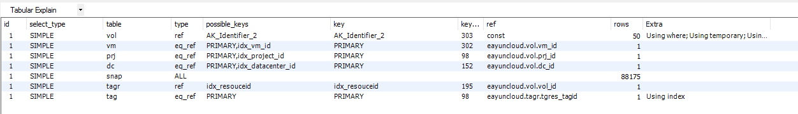

发现snap进行了一个全表扫描，则对于snap.vol_id，应该是没有索引的，查看表结构，确定没有之后，对vol_id字段添加索引，再次查看执行计划得到的结果如下图所示：
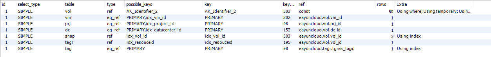
明显看到区别，影响行数从全表到3行，提升明显。上面的查询语句，在准生产执行耗时从70s降低到不到0.1s。

除了添加索引，还可以从业务角度上把查询语句修改，如与晓东沟通后，列表查询不需要展示关联快照的数量，则count(snap.snap_id)其实就没有必要了，也就是联查cloud_disksnapshot就不需要了。考虑到现阶段，修改业务代码，就要重新测试，所以还是先从SQL索引的优化入手。

>Tips：MySQL执行计划解读
>
>我们可以使用语句`Explain select ...`来查看查询的执行计划，也可以使用客户端工具自带的功能，如：
>
>注，解释计划只针对select操作。
>
>id - 包含一组数字，表示查询中执行select子句或操作表的顺序，如果是子查询，id的序号会递增，值越大优先级越高，越先被执行；id相同，执行顺序由上至下
>
>select_type - 表示查询中每个select子句的类型：SIMPLE（不含子查询或者UNION）、PRIMARY（查询中包含任何复杂的子部分，最外层查询会被标志为该类型）、DERIVED（在From列表中包含子查询的类型，中文释义：衍生）等
>
>type - 表示MySQL在表中找到所需行的方式，又称为“访问类型”，常见的类型有：ALL（Full Table Scan）、INDEX（Full Index Scan）、range（索引范围扫描，对索引的扫描开始于某一点，返回匹配值域的行，常见于between、<、>等的查询）、ref（非唯一性索引扫描，返回匹配某个单独值的所有行。常见于使用非唯一索引进行的查找）、eq_ref（唯一性索引扫描，对于每个索引键，表中只有一条记录与之匹配，常见于主键或唯一索引扫描）、const/system（当MySQL对查询某部分进行优化，并转换为一个常量时，使用这些类型访问。如将主键置于where列表中）、NULL（MySQL在优化过程中分解语句，执行时甚至不用访问表或索引）。注，由左到右，性能由最差到最好。
>
>possible_keys - 列举出可使用的索引，但不一定会被用到
>key - 实际使用的索引，如果没有使用索引，显示为空
>key_len - 表示索引中使用的字节数，可通过该列计算查询中使用的索引的长度
>ref - 表示上述表的连接匹配条件，即哪些列或常量被用于查找索引列上的值
>rows - 表示MySQL根据表统计信息及索引选用情况，估算的找到所需的记录所读取的行数
>extra - 包含不适合在其他列中显示但十分重要的额外信息


### 3.2 云硬盘快照列表查询优化

同样的套路，我们把云硬盘快照的查询SQL取出来，替换一下参数，得到如下SQL：
```sql
SELECT 
    snap.snap_id AS snapId,
    snap.snap_name AS snapName,
    snap.snap_size AS snapSize,
    snap.snap_status AS snapStatus,
    snap.snap_description AS snapDescription,
    snap.prj_id AS prjId,
    snap.dc_id AS dcId,
    snap.create_time AS createTime,
    snap.vol_id AS volId,
    vol.vol_name AS volName,
    COUNT(volume.vol_id) AS volNum,
    prj.prj_name AS prjName,
    dc.dc_name AS dcName,
    snap.pay_type AS payType,
    snap.charge_state AS chargeState,
    snap.snap_type AS snapType
FROM
    cloud_disksnapshot snap
        LEFT JOIN
    (SELECT 
        vol_id, vol_name
    FROM
        cloud_volume
    WHERE
        is_deleted = '0' AND is_visable = '1') vol ON snap.vol_id = vol.vol_id --这里还有一个内嵌查询，虽然也是查的volume表
        LEFT JOIN
    cloud_volume volume ON snap.snap_id = volume.from_snapid -- from_snapid有很大的概率没有索引
        AND volume.is_deleted = 0
        LEFT JOIN
    cloud_project prj ON snap.prj_id = prj.prj_id
        LEFT JOIN
    dc_datacenter dc ON snap.dc_id = dc.id
WHERE
    1 = 1 AND snap.is_visable = '1'
        AND snap.is_deleted = '0'
        AND snap.dc_id = '1601281411350'
        AND snap.prj_id = 'ID_FOR_AUTO_GENERATED_CUS49'
GROUP BY snap.snap_id
ORDER BY snap.create_time DESC

```
有了这个猜想之后，我们查看执行计划：
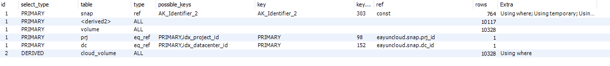

确实可以看到volume表是全表扫描，查看表结构，from_snapid无索引，添加后执行计划如下所示：
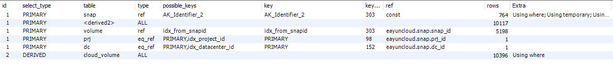

从耗时上来看，未添加索引前，查询耗时143.422s，添加索引后，查询耗时7.234s，提升明显，但是一个查询7s还是略长。


## 4. 第三次调整优化

在对两个SQL添加索引之后，又做了一次700人的压测，这次和第一轮压测的数据量（700人）、时长（2h48min）是一致的，得到的结果如下图所示：
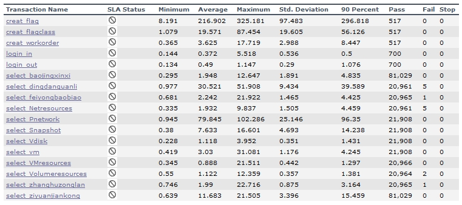

从这一次结果来看，查询云硬盘、云贵硬盘快照的耗时（一般看90%通过率的耗时）相比之前的250s、89s有了很高的提升。那我们姑且把这两个查询放一放，继续找耗时较长的事务。可以看到，`select_pnetwork`和`select_dingdanguanli`耗时也不短，与罗利君沟通后，我们明确了这两个查询分别是查询私有网络和查询订单列表。

### 4.1 私有网络查询优化
继续取SQL：
```sql
SELECT 
    cn.net_id,
    cn.net_name,
    cn.net_status,
    cn.admin_stateup,
    cn.prj_id,
    cn.dc_id,
    COUNT(cs.subnet_id) subNetCount,
    rou.rate,
    rou.net_name extNetName,
    rou.route_name,
    rou.route_id,
    rou.gateway_ip,
    cn.pay_type,
    cn.charge_state,
    cn.create_time,
    cn.end_time,
    dc.dc_name
FROM
    cloud_network cn
        LEFT OUTER JOIN
    cloud_subnetwork cs ON cn.net_id = cs.net_id
        LEFT OUTER JOIN
    dc_datacenter dc ON cn.dc_id = dc.id
        LEFT OUTER JOIN
    (SELECT 
        cr.rate,
            cn1.net_name,
            cr.network_id,
            cr.route_name,
            cr.route_id,
            cr.gateway_ip
    FROM
        cloud_route cr
    LEFT OUTER JOIN cloud_network cn1 ON cn1.net_id = cr.net_id) rou ON rou.network_id = cn.net_id
WHERE
    cn.router_external = '0'
        AND cn.prj_id = 'ID_FOR_AUTO_GENERATED_CUS49'
        AND cn.is_visible = '1'
GROUP BY cn.net_id
ORDER BY cn.create_time DESC
```
同样的各种join和内嵌查询混合使用，检查执行计划，如下图所示：
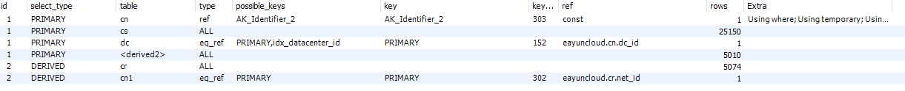

有三个全表扫描，分别是cr、<derived2>和cs，通过执行计划我们从id=2开始看（从下往上，从里往外看），检查join的几张表，分别是cloud_subnetwork、cloud_route、cloud_network，增加cloud_subnetwork的net_id的索引，增加cloud_route表的net_id和network_id的索引，再次检查执行计划，如下图所示：
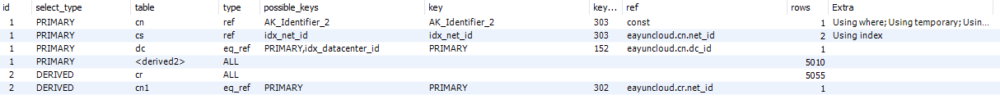

能看到我们在cs上使用索引之后，能减少影响25150行到2行，效果显著。

### 4.2 订单查询优化

订单的查询比较简单，如下所示：
```sql
SELECT 
    *
FROM
    order_info
WHERE
    create_time >= '2017-01-01 00:00:00'
        AND create_time <= '2017-01-06 00:00:00'
        AND cus_id = '998083a7591f2ff901591f92fc1e0000';
```
从查询中我们可以看到cus_id做为外键，如果查询较慢的话，问题应该出在它身上，果不其然，检查了订单表，添加索引之后，从原来的全表扫描，最终得到的执行计划如下所示：
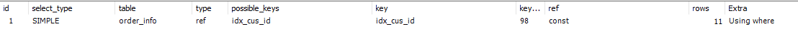

## 5 1000人并发压测

网路优化后，订单未优化前又进行了一次700人的压测，结果如下图：
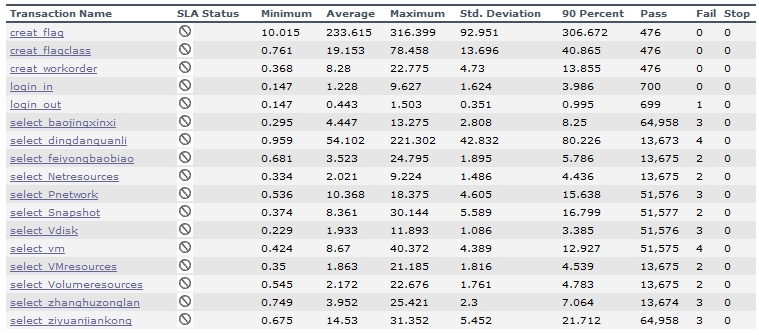
网络的查询从96.35s降低至15.638s。

在第四章节的SQL优化全部做完之后仅进行了1000人的压测，结果如下图：
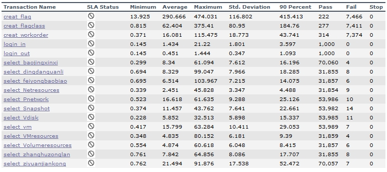
可以看到，订单查询的耗时，从之前700人压测的80.226s降低至了18.285s。

## 6.总结

本次查询从四个方面进行了优化，分别是：
* JDBC连接池配置
* Tomcat服务器配置
* MySQL配置文件配置
* SQL优化

从本次SQL优化的过程和结果看，我们其实有遵循一定的"潜规则"，有：
* Step.1 - 先望一眼SQL，初步推测哪些需要索引但是可能没有
* Step.2 - 查看执行计划，分析执行计划
* Step.3 - 检查表结构，合理添加索引
* 重复Step.2，知道执行计划看到一个满意的结果

当然，上述套路是建立在尽可能少或者不动业务代码上，仅从SQL层面去靠添加索引来优化。

此外，在这里共同学习一下一些博主总结的优化原则：
1. 使用JOIN时候，应该用小的结果驱动大的结果（left join 左边表结果尽量小，如果有条件应该放到左边先处理，right join 同理反向），同时，尽量把牵涉到多表联合的查询拆分多个query(多个连表查询效率低，容易到之后锁表和阻塞)
2. 注意LIKE模糊查询的使用，避免使用 %% ,可以使用后面带% ，双%是不走索引
3. 避免使用count(*)，会加一个表级锁
4. 在做查询时，要合理的对主键、外键添加索引，如果where条件中多个查询条件，优先将有索引的字段放在前面，这样后面的查询会建立在较少的结果数据中
5. 对where、group by、order by和join on的字段使用索引
6. 保持索引的简洁，尽量避免复合索引，尤其要避免复合索引上重复覆盖单字段索引
7. ...

靠列举规则是没有办法列举全的，只能慢慢在实践中摸索，掌握优化的"潜规则"——一初看二执行三分析四重复，不断尝试，不断推进优化效果。

